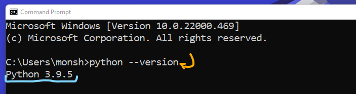
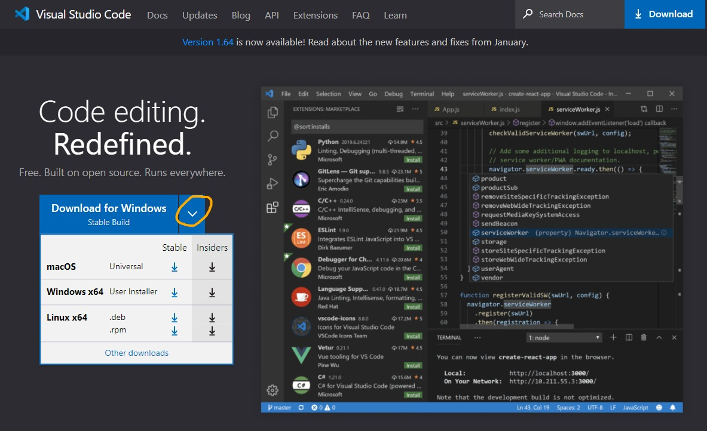
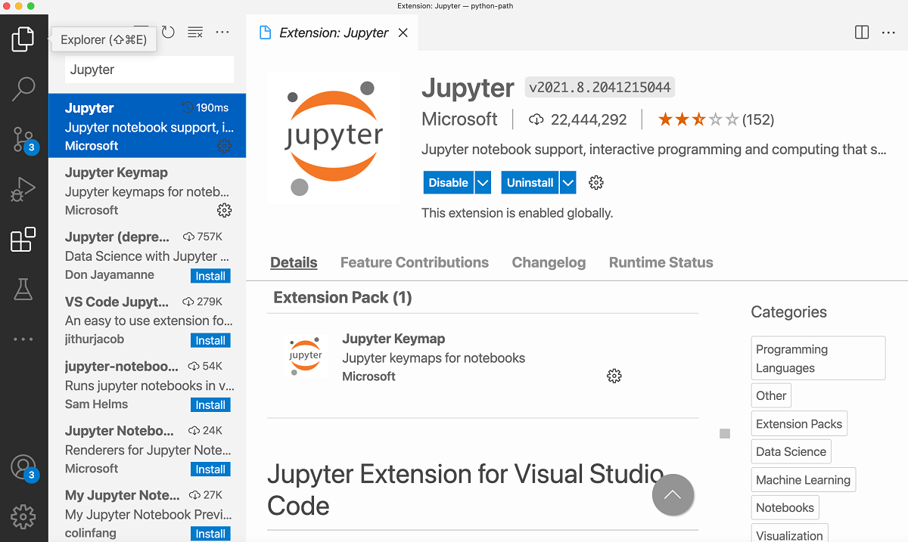
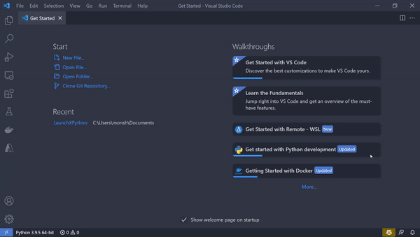
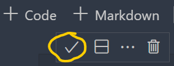
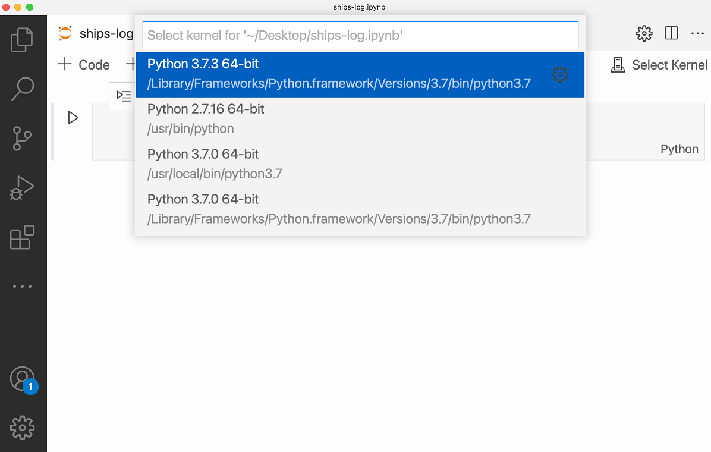
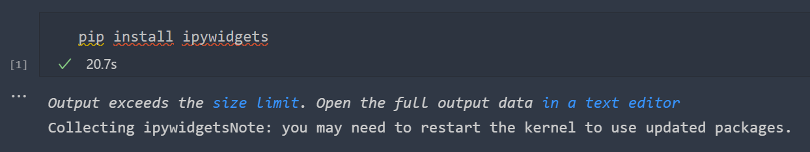
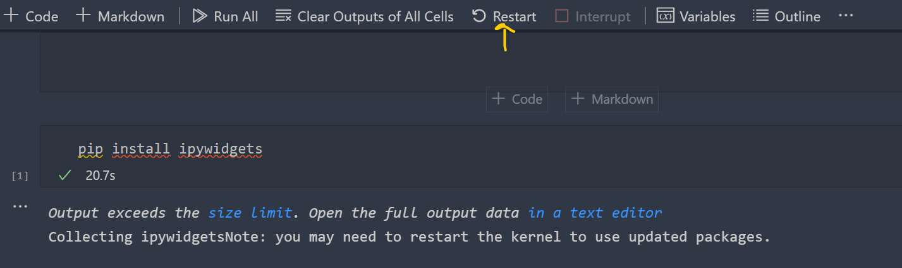
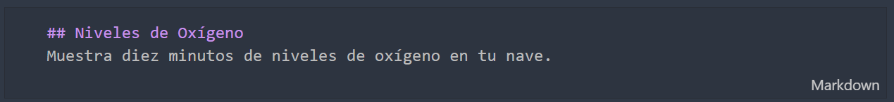

# Introducción

Aunque los desarrolladores web crean sus sitios web mediante el uso de herramientas como Node.js, ASP.NET o Java, y ejecutan su código localmente mediante el uso de herramientas en editores de código como Visual Studio Code, los desarrolladores de Python tienen algunas otras herramientas a su disposición.

Una de esas herramientas útiles se llama ``notebook / notebook ``. Un notebook es un entorno interactivo que un desarrollador puede usar para ejecutar bloques de código y agregar áreas de documentación para explicar el código en sí. Aunque los desarrolladores de Python también pueden usar archivos .py para ejecutar programas de Python directamente, pueden usar notebooks para ejecutar y documentar su código, explicando su lógica en el camino.

## Escenario: Miembro de la tripulación en la ISS

Supongamos que eres un miembro de la tripulación en una nave espacial. Su misión es entregar algunos equipos importantes a la Estación Espacial Internacional (ISS). Si no está familiarizado con algunos de los muchos botones de la consola de la nave espacial, ¡Es mejor no aprender por el método de prueba y error, en pleno vuelo! En su lugar, puede consultar el manual de viaje para saber qué botones presionar para realizar varias tareas. Pero, ¿Qué pasa si el manual está incompleto?

Su trabajo es mejorar el registro de la nave mediante la creación de explicaciones interactivas de los controles de la nave. Al trabajar con un notebook, puede explicar más fácilmente los usos de las distintas partes de la consola.

## ¿Qué aprenderás?

Al final de este módulo, podrás:

* Crear un notebook de Jupyter localmente.
* Ejecutar un notebook de Jupyter mediante Python en Visual Studio Code.
* Describir algunas de las formas de crear un notebook.

## ¿Cuál es el objetivo principal?

Aprovechar los notebooks como una herramienta para crear una experiencia de aprendizaje más interactiva.

# Configurando el entorno de trabajo

Hay muchas maneras de ejecutar notebooks. En varios de los módulos de este OnBoarding ejecutarás notebooks. En este módulo, sin embargo, aprenderás a configurar tu entorno de trabajo para ejecutar notebooks localmente a través de Visual Studio Code.

Para comenzar a crear tu notebook, debes tener el siguiente software (programas) disponible en su computadora:

* Python
* Visual Studio Code
* Extensión Jupyter de Visual Studio Code

## Instalando Python

Si no tienes Python instalado en su computadora, debes descargarlo. Dirígete a la siguiente dirección [Python.org](https://www.python.org/downloads/) para instalar la última versión compatible con tu sistema operativo.

Si ya tiene Python instalado, es posible que deba actualizar la instalación a la versión más reciente. Puedes verificarlo al abrir la terminal:

* En windows: Presiona la tecla windows, posteriormente escribe 'cmd' y presiona enter.
* En Mac: Finder - Terminal - Enter
  Posteriormente escribe el siguiente comando:

``python --version``

Es importante lo escribas exactamente igual, ya que al tratarse de un comando si no está escrito correctamente podría no saber la computadora a qué te refieres.

Al ejecutar el comando te mostrará la versión que tienes actualmente instalada, para este entrenamiento, utilizaremos de la versión 3 para arriba.



## Instalando Visual Studio Code

A continuación, instala Visual Studio Code. Para ello dirígete a la siguiente dirección [Visual Studio Code](https://code.visualstudio.com/), selecciona el sistema operativo de tu preferencia.
Si no ves la opción de tu sistema, selecciona la flecha para ver más sistemas disponibles.



Cuando se complete la instalación, configúrala a tu gusto.

## Instalando la extensión de Python

Esta extensión permite ejecutar notebooks de Jupyter desde Visual Studio Code mediante un [Kernel](https://es.wikipedia.org/wiki/N%C3%BAcleo_(inform%C3%A1tica)). Un kernel en Visual Studio Code le ayuda a activar un entorno de Anaconda, por lo que puede ejecutar sus notebooks mediante la instalación de Python.

En Visual Studio Code, en el panel de extensiones de la izquierda, busque Jupyter de Microsoft. Para instalar esta extensión, seleccione Instalar.



Ahora que tienes configurados los tres elementos del área de trabajo, puedes empezar a trabajar con los notebooks de Jupyter en Visual Studio Code.

# Ejercicio 1: Crea y ejecuta tu notebook

Un notebook es un entorno interactivo en el que se puede escribir código y documentarlo. Los notebooks también pueden mostrar cálculos matemáticos y gráficos.

Aquí, crearás un archivo .ipynb local y lo ejecutarás en Visual Studio Code. El sufijo ``.ipynb`` se utiliza para referirse a los notebooks de Jupyter, que anteriormente se llamaban: ``.iPython:`` ``notebooksipynb``

## Crear un notebook

Crea el archivo a través de la paleta de comandos en Visual Studio Code, abriendo la paleta y escribiendo el nombre del notebook: ``ship-manual.ipynb``



La extensión Jupyter debe mostrar el archivo en blanco, con la opción de agregar código (python) y bloques Markdown (Un lenguaje de etiquetas, similar a html que veremos más adelante).

### Crear un elemento de tipo Markdown

En la parte superior del notebook, verás dos opciones para crear dos tipos diferentes de bloques de contenido en el notebook: **Markdown** y **código ejecutable**.

La primera tarea es crear un título de documento. En la parte superior de la interfaz del notebook de Visual Studio Code, selecciona el botón más (+) situado junto a Markdown. Aparecerá un cuadro. Agregue el siguiente Markdown al cuadro:

`` # Manual de la Nave``

Selecciona la palomita para ver el resultado.


¡Acabas de nombrar tu notebook! Para ver cómo se representa este archivo Markdown, elige ejecutar todo desde la parte superior del notebook o la flecha pequeña a la izquierda del cuadro Markdown.`<h1>`

### Ejecutar el notebook

Ahora necesitas ejecutar tu notebook. Elige un kernel de la lista desplegable en la parte superior derecha. Es posible que tengas uno o varios núcleos para elegir, así que asegúrese de elegir un kernel de Python 3.



### Crear código ejecutable

Ahora puedes agregar algo de código al notebook. Agreguemos una forma de mostrar un widget para iniciar el notebook.

Primero, debes instalar una biblioteca llamada ``ipywidgets``. Instala la biblioteca agregando un nuevo bloque de código debajo del bloque de título del notebook. Utilizando el administrador de paquetes de Python ``pip``, para instalar la biblioteca.

``pip install ipywidgets``



Después de instalarlo, te pedirá que reinicies el kernel. Basta con dar clic en la sección señalada de amarillo para reiniciar el kernel.



A continuación, crearemos un botón en el notebook que, cuando se presiona, muestra un mensaje.

En un nuevo bloque de código, agrega el código siguiente:

```
import ipywidgets as widgets

ignition = widgets.ToggleButton(
    value=False,
    description='Iniciar Launch',
    button_style='success',
    tooltip='Engage your Launch',
    icon='rocket'
)

output = widgets.Output()

display(ignition, output)

def on_value_change(change):
    with output:
        if change['new'] == True:
            print("Nave Iniciada!")
        else:   
            print("Nave Detenida")

ignition.observe(on_value_change, names='value')
```


¿Qué está pasando aquí? Utilizamos la biblioteca ``ipywidget`` para crear un botón y éste escucha cuando hacemos un clic provocando que su valor cambie, imprimiendo el mensaje observado. ¡Ahora tu manual está empezando a verse bien, y puedes arrancar la nave aún si se detiene!

## Ejercicio 2: Usar comandos avanzados

Hemos creado un notebook básico con un poco de Markdown y un widget para arrancar la nave. Sin embargo, ¡Hay mucho más que puedes hacer con los notebooks!

En el manual de su nave, le gustaría crear un gráfico de las estadísticas diarias de su nave. Puedes crear todo tipo de gráficos interesantes en un notebook, que también es útil para científicos de datos e ingenieros de aprendizaje automático (no solo astronautas).

Crea un gráfico para mostrar los niveles de oxígeno de su nave utilizando ``Matplotlib y Numpy``, unas bibliotecas populares para crear tablas y gráficos en Python.

Para ello en una celda de código vamos a ejecutar el siguiente comando:

```
    !pip install matplotlib
    !pip install numpy
```

Enseguida, crea un bloque Markdown para anotar la descripción:



```
## Niveles de Oxígeno

Muestra diez minutos de niveles de oxígeno en tu nave.
```

Creamos un nuevo bloque de código e importamos dos bibliotecas ```numpy``` y ```matplotlib```, para crear un gráfico de barras.

```
    import numpy as np
    import matplotlib.pyplot as plt
    data = np.random.default_rng(12345)
    oxy_nums = data.integers(low=0, high=10, size=10)

    plt.bar(range(len(oxy_nums)), oxy_nums)
    plt.show()
```    
Por supuesto, estos datos son una maqueta de datos reales, que se utilizan para crear una matriz de 100 enteros entre 1 y 10.

El gráfico de barras se ve así:


### Realizar cálculos 
A continuación, deseas mostrar el tiempo que su barco necesita tomar para llegar a una buena velocidad. Anota y crea una ecuación que te permitirá ingresar la velocidad de inicio de tu nave, la velocidad final deseada y la aceleración en metros por segundo.

Creamos un bloque markdown para explicar la ecuación:

``` 
## Velocidad de la nave

Muestra los segundos necesarios para pasar de 0 a 11200 metros por segundo, dada la aceleración de la nave en metros por segundo.
``` 

Agrega un bloque de código para la ecuación:

``` 
endVelocity = 11200
startVelocity = 0
acceleration = 9.8

time = (endVelocity - startVelocity) / acceleration
print("Tiempo para alcanzar la velocidad deseada = ", time)
``` 

Ejecuta el bloque de código para determinar cuánto tiempo tardará en alcanzar la velocidad deseada.

Ajusta los valores de velocidad de inicio y fin, o la aceleración, para determinar cómo funcionará tu nave espacial.

¡Felicidades! Has creado con éxito el manual de una nave que muestra información útil sobre su nave espacial. Debido a que todo está contenido en un notebook de Jupyter, no tendrás ninguna dificultad para realizar un seguimiento de él, ya que está bien anotado y bien mostrado. ¡Incluso incluye un interruptor de encendido! Los notebooks Jupyter son una forma útil de mostrar todo tipo de datos e incluso pequeñas interfaces de usuario.


Curso Propedútico de Python para Launch X - Innovacción Virtual.

Material desarrollado con base en los contenidos de MSLearn y la metáfora de LaunchX, traducción e implementación por: Fernanda Ochoa - Learning Producer de LaunchX.

Redes:
* GitHub: [FernandaOchoa](https://github.com/FernandaOchoa)
* Twitter: [@imonsh](https://twitter.com/imonsh)
* Instagram: [fherz8a](https://www.instagram.com/fherz8a/)
